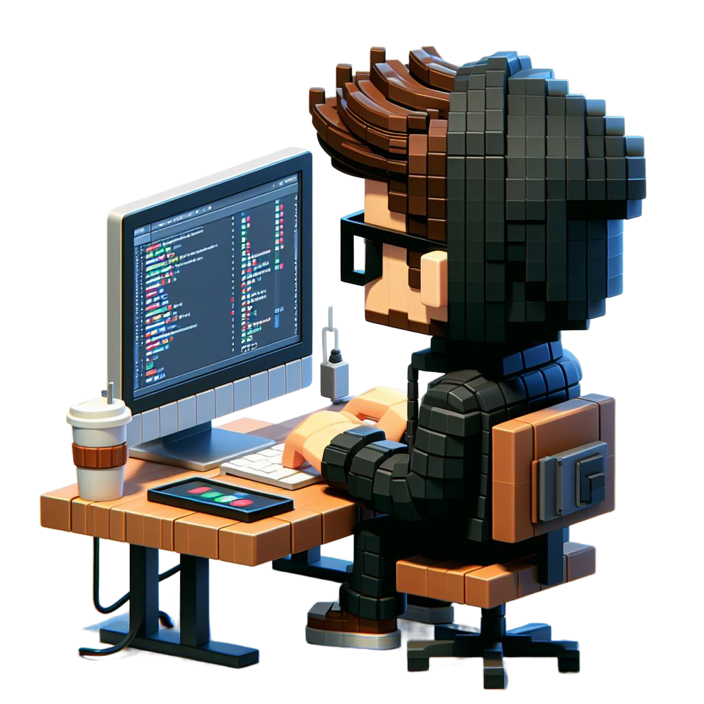

<h1 align="center">
  Olá mundo 👋
</h1>

<div align="center">
   <!--  -->
   
</div>

<br>

<h1 align="center">
  Sobre mim! 🧑‍💻
</h1>

```javascript
export default {
  name: 'Vinícius Raniery Pereira',
  from: 'Arraias, TO, Brasil',
  profession: 'Desenvolvedor Web Full Stack',
  hobbies: ['Ouvir músicas', 'Leitura', 'Games'],
  email: ['viniciusraniery@outlook.com', 'contactviniciusr@gmail.com'],
  linkedin: 'https://www.linkedin.com/in/viniciusraniey/',
  portfolio: 'Ainda em andamento',
  contato: '(63) 99132-6323',
  description: {
    myProfile: `Olá, sou Vinícius Raniery, um entusiasta por programação web e entusiasta de experiência do usuário. 
    Graduado pelo IF Goiano, construí uma base sólida para minha jornada no mundo da tecnologia.

    🛠️ Minha Jornada Profissional:
    Ao longo dos anos, tenho trilhado uma carreira desafiadora como desenvolvedor front-end, contribuindo para diversos projetos que demandaram soluções inovadoras. Minha expertise abrange habilidades sólidas em HTML, CSS, JavaScript, e frameworks como React. 
    Além disso, tenho conhecimento em bancos de dados e integração de APIs, proporcionando experiências interativas e eficientes.

    🎓 Formação Acadêmica:
    Orgulhosamente graduado pelo IF Goiano, adquiri conhecimentos fundamentais que serviram como alicerce para minha trajetória profissional. 
    A formação sólida proporcionada pela instituição contribuiu significativamente para o meu crescimento como desenvolvedor.

    🚀 Em Busca de Inovação:
    Atualmente, estou imerso em desafios mais avançados, buscando aprimorar minhas habilidades e explorando o fascinante mundo da Inteligência Artificial. 
    Através de cursos dedicados, estou adquirindo conhecimento para integrar IA em projetos futuros, elevando ainda mais a qualidade das soluções que desenvolvo.`,
  },
  skills: {
    languages: [
      'Javascript', 'React',
    ],
    backend: [
      'Node.js', 'MySQL', 'MongoDB',
    ],
    frontend: [
      'HTML5', 'CSS3', 'Javascript', 'React', 'Next',
    ],
    tools: [
      'Git', 'Github',
    ],
  },
};
```

<br>

<h1 align="center">
  Conecte comigo: 👇
</h1>

<section align="center">
  <p
    align="center"
    class="connection-container"
  >
    <a
      href="https://github.com/VncsRaniery"
      target="_blank"
    >
      
    </a>
    <a
      href="https://www.linkedin.com/in/viniciusraniey/" target="_blank"
    >
      
    </a>
    <a
      href="mailto:viniciusraniery@outlook.com"
      target="_blank"
    >
      
    </a>
  </p>
</section>
<br><br>

<h1 align="center">
  Tecnologias e ferramentas 💡
</h1>

<div align="center" style="display: inline_block"><br>
        
        
        
        
        
        
        
        
        
        
        
    </div>

<br><br>

<h1 align="center">
  Estatísticas 📈
</h1>
<div align="center">
<h3>GitHub Stats</h3>


<h3>GitHub Streak</h3>


<h3>Top Linguagens</h3>


</div>

